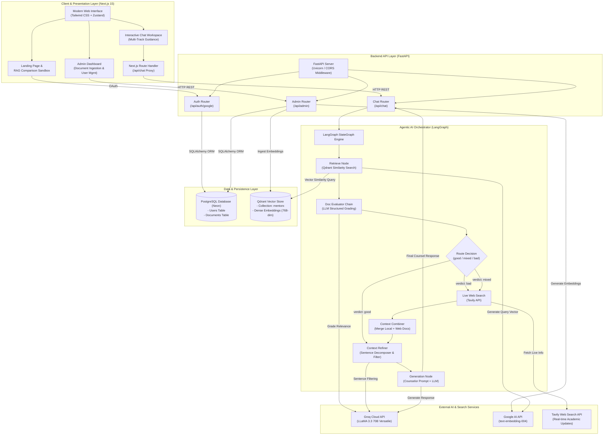
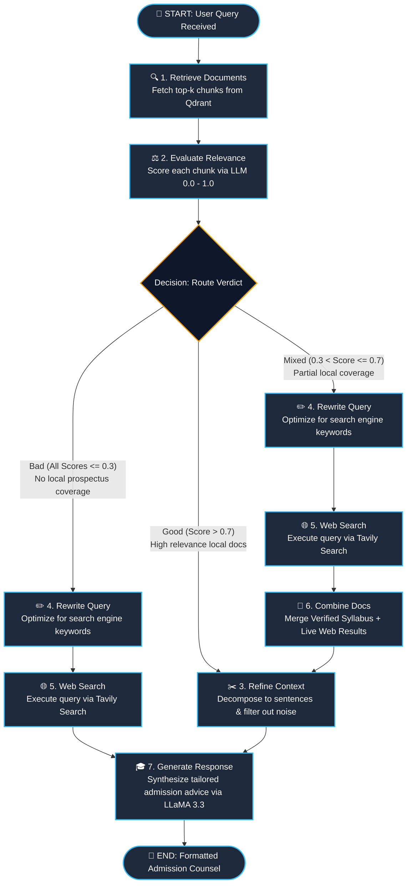
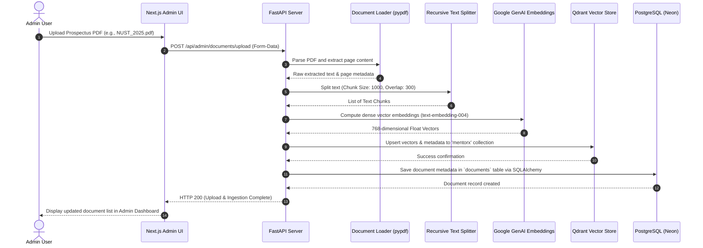
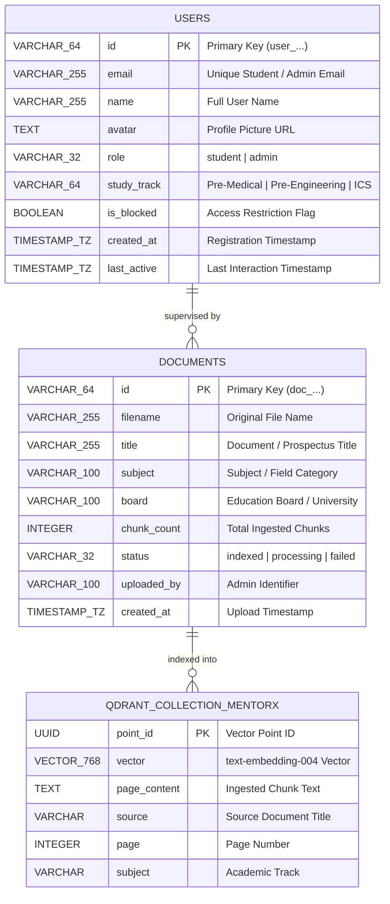

# 🎓 MentorX — AI Academic Intelligence & Admission Guidance Platform

[](https://nextjs.org/)
[](https://fastapi.tiangolo.com/)
[](https://langchain-ai.github.io/langgraph/)
[](https://qdrant.tech/)
[](https://neon.tech/)
[](https://groq.com/)
[](https://ai.google.dev/)
[](https://www.typescriptlang.org/)

---

## 📌 Table of Contents

- [Overview](#-overview)
- [Key Features](#-key-features)
- [System Architecture](#-system-architecture)
- [LangGraph Adaptive RAG Workflow](#-langgraph-adaptive-rag-workflow)
- [Data Ingestion & Indexing Pipeline](#-data-ingestion--indexing-pipeline)
- [Database Schema & ER Diagram](#-database-schema--er-diagram)
- [Project Directory Structure](#-project-directory-structure)
- [Technology Stack](#-technology-stack)
- [Getting Started & Local Setup](#-getting-started--local-setup)
  - [Prerequisites](#prerequisites)
  - [Backend Setup](#1-backend-setup)
  - [Frontend Setup](#2-frontend-setup)
- [Environment Configuration](#-environment-configuration)
- [API Reference](#-api-reference)
- [Roadmap & Contributing](#-roadmap--contributing)

---

## 📖 Overview

**MentorX** is an enterprise-grade, **Agentic AI Academic Intelligence & University Admission Counselor** tailored specifically for students completing **Intermediate (FSc Pre-Medical, Pre-Engineering, ICS)** and **O/A-Levels**. 

Navigating the higher education landscape presents steep hurdles: opaque aggregate calculation formulas, fragmented merit cutoff archives, shifting Higher Education Commission (HEC) policies (such as Pre-Med transitions into Computer Science), and complex entry tests (**NUST NET, FAST Test, UET ECAT, MDCAT, GIKI, PIEAS, LUMS LCAT/SAT**).

MentorX solves these challenges through an **Adaptive Self-Reflective Retrieval-Augmented Generation (RAG)** pipeline built on **LangGraph**. It combines verified local university prospectuses and past merit cutoffs stored in a **Qdrant Vector Database** with dynamic real-time web retrieval (**Tavily Search**) and sentence-level contextual refinement to eliminate hallucinations and produce data-backed admission strategies.

---

## ✨ Key Features

- **🧠 Adaptive LangGraph RAG Pipeline**: Dynamically retrieves, grades, refines, and optionally triggers web search fallbacks based on chunk relevance scores.
- **📊 Precise Aggregate & Merit Computation**: Built-in logic for official university aggregate formulas (NUST 75/15/10, FAST 50/40/10, UET 33/50/17, MDCAT 50/40/10, etc.).
- **🔄 Inter-Disciplinary Transition Guidance**: Guides Pre-Medical students through HEC deficiency math bridge requirements for computing and AI degrees.
- **📄 Document Ingestion Portal**: Admins can upload official prospectuses, policy documents, and merit PDFs with customizable chunk sizes and overlap into Qdrant.
- **🛡️ Secure Multi-Role Authentication**: Google OAuth authentication with role-based access control (Student vs Admin) and instant blocklist enforcement.
- **⚡ Ultra-Low Latency Inference**: Powered by Groq LLaMA 3.3 70B for near-instant structured extraction, grading, and counsel generation.
- **💻 Modern Interactive UI**: Built with Next.js 15, Tailwind CSS, Zustand, glowing ambient animations, dynamic markdown rendering, and export utilities (PDF/Markdown).

---

## 🏗️ System Architecture

The MentorX architecture follows a modular, decoupled design with a **Next.js 15 Frontend**, a **FastAPI Microservice Backend**, an **Agentic LangGraph Orchestrator**, a **Qdrant Vector Database**, and a **PostgreSQL (Neon) Relational Database**.



---

## 🔁 LangGraph Adaptive RAG Workflow

MentorX implements an **Agentic Self-Reflective RAG** pattern. When a user submits an admission question, the system does not simply feed retrieved chunks to the LLM. Instead, it grades chunk relevance, triggers targeted web searches if coverage is lacking or mixed, strips out irrelevant sentences, and synthesizes a verified response.



### Pipeline Node Roles:
| Node Name | Component File | Description |
| :--- | :--- | :--- |
| **`retrieve`** | `app/Pipeline/retrieve_node.py` | Generates 768-dim query vector using Google embeddings and retrieves top 4 candidate chunks from Qdrant. |
| **`evaluate`** | `app/Pipeline/eval_node.py` | Uses `doc_eval_chain` (LLaMA 3.3 70B) with structured JSON output to grade each chunk from $0.0$ to $1.0$. Sets state verdict: `good`, `mixed`, or `bad`. |
| **`route`** | `app/Pipeline/route.py` | Conditional router determining whether to refine immediately or perform query rewriting and web searches. |
| **`rewrite_query`** | `app/Pipeline/web_node.py` | Rewrites conversational student prompts into targeted 6–14 word search engine keywords via `web_rewrite_chain`. |
| **`web_search`** | `app/Pipeline/web_node.py` | Fetches real-time web results via Tavily Search API with URL and snippet metadata. |
| **`combine_docs`** | `app/Pipeline/combine_docs_node.py` | Integrates verified local textbook/prospectus documents with live external web sources. |
| **`refine`** | `app/Pipeline/refine.py` | Splits combined context into atomic sentences using regex, then filters out extraneous details using `filter_chain`. |
| **`generate`** | `app/Pipeline/generate_node.py` | Constructs the final prompt for the MentorX Admissions Counselor persona, outputting aggregate calculations, merit percentiles, and actionable strategies. |

---

## 📥 Data Ingestion & Indexing Pipeline

Admins can upload university prospectuses, syllabus documents, and merit list PDFs. The pipeline ingests documents into **Qdrant** and tracks records in **PostgreSQL**.



---

## 🗄️ Database Schema & ER Diagram

MentorX uses **PostgreSQL (via Neon Cloud)** managed through **SQLAlchemy 2.0 ORM** for transactional entities, and **Qdrant** for high-dimensional vector representations.



---

## 📂 Project Directory Structure

```plaintext
MentorX/
├── README.md                          # Root Project Documentation
├── mentorx/
│   ├── backend/                       # FastAPI + LangGraph Backend
│   │   ├── app/
│   │   │   ├── api/                   # FastAPI Endpoints & Routers
│   │   │   │   ├── admin.py           # Admin stats, user blocking, doc upload
│   │   │   │   ├── auth.py            # Google OAuth & session verification
│   │   │   │   └── chat.py            # LangGraph chat execution endpoint
│   │   │   ├── Chunker/               # Text splitting utilities
│   │   │   │   └── chunker.py         # RecursiveCharacterTextSplitter wrapper
│   │   │   ├── config/                # Environment & Pydantic settings
│   │   │   │   └── settings.py        # Typed application configuration
│   │   │   ├── db/                    # Database connection & session factory
│   │   │   │   ├── database.py        # Database health & connection helpers
│   │   │   │   └── session.py         # SQLAlchemy engine, sessionmaker, Base
│   │   │   ├── LLM/                   # LLM & Embedding Model factories
│   │   │   │   ├── embedding_llm.py   # Google Generative AI embeddings setup
│   │   │   │   └── llm.py             # Groq ChatGroq LLM wrapper
│   │   │   ├── loader/                # Document loaders
│   │   │   │   └── documentLoader.py  # PyPDFLoader and text extractor
│   │   │   ├── models/                # SQLAlchemy ORM Models
│   │   │   │   ├── document.py        # Document entity
│   │   │   │   └── user.py            # User entity
│   │   │   ├── Pipeline/              # LangGraph Agentic RAG Pipeline
│   │   │   │   ├── combine_docs_node.py # Local & Web docs aggregator
│   │   │   │   ├── eval_node.py       # LLM-based chunk relevance evaluator
│   │   │   │   ├── generate_node.py   # Admissions counselor response generator
│   │   │   │   ├── refine.py          # Sentence-level decomposer & filter
│   │   │   │   ├── retrieve_node.py   # Qdrant vector retrieval node
│   │   │   │   ├── route.py           # Conditional verdict router
│   │   │   │   ├── State.py           # LangGraph Typed State (Pydantic)
│   │   │   │   ├── web_node.py        # Query rewriter & Tavily search node
│   │   │   │   └── workflow.py        # LangGraph StateGraph assembly
│   │   │   ├── repositories/          # Data Access Object (DAO) layer
│   │   │   │   ├── document_repository.py
│   │   │   │   └── user_repository.py
│   │   │   ├── schemas/               # Pydantic Request/Response DTOs
│   │   │   │   ├── chat.py
│   │   │   │   ├── document.py
│   │   │   │   └── user.py
│   │   │   ├── services/              # Business logic layer
│   │   │   │   ├── document_service.py
│   │   │   │   └── user_service.py
│   │   │   ├── utility/               # Structured output LLM chains
│   │   │   │   ├── decompose_sentences.py
│   │   │   │   ├── doc_eval_chain.py
│   │   │   │   ├── filter_chain.py
│   │   │   │   └── web_rewrite_chain.py
│   │   │   └── main.py                # FastAPI app entrypoint & lifecycle
│   │   ├── pyproject.toml             # Python package & dependency spec
│   │   ├── uv.lock                    # Locked dependencies (UV package manager)
│   │   └── .env.example               # Backend environment template
│   │
│   └── frontend/                      # Next.js 15 App Router Frontend
│       ├── public/                    # Static assets & icons
│       ├── src/
│       │   ├── app/
│       │   │   ├── api/chat/route.ts  # Next.js chat proxy API route
│       │   │   ├── globals.css        # Global CSS & Tailwind styling
│       │   │   ├── layout.tsx         # Root HTML layout with Geist font
│       │   │   └── page.tsx           # Dynamic view controller (Loader/Landing/Workspace/Admin)
│       │   ├── components/
│       │   │   ├── admin/             # Admin dashboard & management components
│       │   │   │   └── AdminDashboard.tsx
│       │   │   ├── auth/              # Authentication modal & Google sign-in
│       │   │   │   ├── AuthModal.tsx
│       │   │   │   └── GoogleSignInButton.tsx
│       │   │   ├── landing/           # Landing page sections & interactive widgets
│       │   │   │   ├── FeaturesGrid.tsx
│       │   │   │   ├── HeroSection.tsx
│       │   │   │   ├── IsometricIllustration.tsx
│       │   │   │   ├── LandingNavbar.tsx
│       │   │   │   ├── LandingPage.tsx
│       │   │   │   ├── RagComparisonSandbox.tsx
│       │   │   │   ├── SyllabusExplorer.tsx
│       │   │   │   └── TestimonialsSection.tsx
│       │   │   ├── loader/            # High-tech animated entry loader
│       │   │   │   └── WelcomeLoader.tsx
│       │   │   ├── modals/            # Utility modals
│       │   │   │   ├── ExportModal.tsx
│       │   │   │   ├── HelpModal.tsx
│       │   │   │   ├── SavedPromptsModal.tsx
│       │   │   │   └── SearchModal.tsx
│       │   │   └── workspace/         # Chat workspace interface
│       │   │       ├── ChatThread.tsx
│       │   │       ├── GlowingOrb.tsx
│       │   │       ├── Header.tsx
│       │   │       ├── PromptInput.tsx
│       │   │       ├── Sidebar.tsx
│       │   │       ├── StarterCards.tsx
│       │   │       └── WorkspaceLayout.tsx
│       │   ├── lib/                   # Utility helpers
│       │   │   └── utils.ts
│       │   └── store/                 # Zustand Global State Stores
│       │       ├── useAuthStore.ts
│       │       ├── useChatStore.ts
│       │       └── useUIStore.ts
│       ├── package.json               # Frontend dependencies & scripts
│       ├── tsconfig.json              # TypeScript configuration
│       └── next.config.ts             # Next.js configuration
```

---

## 🛠️ Technology Stack

| Layer | Technologies |
| :--- | :--- |
| **Frontend Framework** | [Next.js 15](https://nextjs.org/) (App Router), [React 19](https://react.dev/), [TypeScript](https://www.typescriptlang.org/) |
| **Styling & UI** | [Tailwind CSS](https://tailwindcss.com/), [Lucide Icons](https://lucide.dev/), Canvas Confetti |
| **Client State Management** | [Zustand](https://github.com/pmndrs/zustand) |
| **Backend Framework** | [FastAPI](https://fastapi.tiangolo.com/) (Python 3.12+), [Uvicorn](https://www.uvicorn.org/), [Pydantic V2](https://docs.pydantic.dev/) |
| **Agentic Framework** | [LangGraph](https://langchain-ai.github.io/langgraph/), [LangChain Core / Community](https://python.langchain.com/) |
| **Vector Database** | [Qdrant](https://qdrant.tech/) (Cloud / Self-Hosted) |
| **Relational Database** | [PostgreSQL (Neon Cloud)](https://neon.tech/) with [SQLAlchemy 2.0 ORM](https://www.sqlalchemy.org/) |
| **LLM Inference** | [Groq Cloud](https://groq.com/) (`llama-3.3-70b-versatile`) |
| **Embeddings** | [Google Generative AI](https://ai.google.dev/) (`models/text-embedding-004`) |
| **Web Search Tool** | [Tavily Search API](https://tavily.com/) |
| **Document Processing** | [PyPDF](https://pypdf.readthedocs.io/), LangChain Recursive Character Text Splitter |

---

## 🚀 Getting Started & Local Setup

### Prerequisites

Ensure you have the following installed on your machine:
- **Node.js**: `v18.18+` or `v20+`
- **Python**: `v3.12+`
- **Package Managers**: `npm` / `pnpm` and `uv` or `pip`
- **Database Accounts / Instances**:
  - PostgreSQL instance (e.g. Neon connection string)
  - Qdrant cluster instance & API Key (Qdrant Cloud)
  - API Keys for Google Generative AI, Groq, and Tavily

---

### 1. Backend Setup

1. **Navigate to the backend directory:**
   ```bash
   cd mentorx/backend
   ```

2. **Create and activate a virtual environment:**
   ```bash
   python3 -m venv .venv
   source .venv/bin/activate    # On Windows: .venv\Scripts\activate
   ```

3. **Install dependencies:**
   ```bash
   pip install -e .
   # Or using uv:
   # uv sync
   ```

4. **Configure environment variables:**
   Create a `.env` file in `mentorx/backend/.env` using `.env.example`:
   ```bash
   cp .env.example .env
   ```
   Fill in your actual API keys and database credentials (see [Environment Configuration](#-environment-configuration)).

5. **Start the FastAPI server:**
   ```bash
   uvicorn app.main:app --reload --host 0.0.0.0 --port 8000
   ```
   - API Docs: [http://localhost:8000/docs](http://localhost:8000/docs)
   - Health Check: [http://localhost:8000/health](http://localhost:8000/health)

---

### 2. Frontend Setup

1. **Navigate to the frontend directory:**
   ```bash
   cd mentorx/frontend
   ```

2. **Install Node dependencies:**
   ```bash
   npm install
   ```

3. **Start the Next.js development server:**
   ```bash
   npm run dev
   ```
   - Web Application: [http://localhost:3000](http://localhost:3000)

---

## ⚙️ Environment Configuration

### Backend `.env` (`mentorx/backend/.env`)

```env
# Application Settings
APP_NAME="MentorX API"
APP_VERSION="1.0.0"
APP_DESCRIPTION="AI Academic Guidance Assistant for FSc Students"
DEBUG=False

# PostgreSQL / Neon Database Connection
DATABASE_URL="postgresql://<user>:<password>@<neon-host>/<dbname>?sslmode=require"

# Google Generative AI (Embeddings)
GOOGLE_API_KEY="your-google-ai-api-key"
EMBEDDING_MODEL_NAME="models/text-embedding-004"

# Groq Cloud (Inference LLM)
GROQ_API_KEY="your-groq-api-key"
GROQ_MODEL="llama-3.3-70b-versatile"

# Qdrant Vector Database
QDRANT_URL="https://your-qdrant-cluster-url.cloud.qdrant.io:6333"
QDRANT_API_KEY="your-qdrant-api-key"
QDRANT_COLLECTION_NAME="mentorx"

# Tavily Web Search API (Optional for web search node)
TAVILY_API_KEY="your-tavily-api-key"

# Text Chunking Settings
CHUNK_SIZE=1000
CHUNK_OVERLAP=300
```

---

## 📡 API Reference

### Health & Root
| Method | Endpoint | Description |
| :--- | :--- | :--- |
| `GET` | `/` | Root status message and link to Swagger documentation. |
| `GET` | `/health` | Application status, version, and database connection type. |

### Chat & LangGraph Pipeline
| Method | Endpoint | Request Body | Description |
| :--- | :--- | :--- | :--- |
| `POST` | `/api/chat` | `{ "question": str, "user_id": str, "deep_research": bool, "web_search": bool }` | Executes query through the full LangGraph RAG workflow and returns structured guidance, citations, and verdict. |

### Authentication
| Method | Endpoint | Request Body | Description |
| :--- | :--- | :--- | :--- |
| `POST` | `/api/auth/google` | `{ "email": str, "name": str, "avatar": str, "study_track": str }` | Authenticates or registers a user via Google OAuth and checks block status. |
| `GET` | `/api/auth/me/{user_id}` | *None* | Retrieves current user profile and verifies access rights. |

### Admin Management
| Method | Endpoint | Parameters / Body | Description |
| :--- | :--- | :--- | :--- |
| `GET` | `/api/admin/stats` | *None* | Retrieves real-time counts for active students, total documents, and system health. |
| `GET` | `/api/admin/users` | *None* | Lists all registered students and administrators. |
| `PATCH` | `/api/admin/users/{id}/status` | `{ "is_blocked": bool }` | Blocks or unblocks a specific student account. |
| `GET` | `/api/admin/documents` | *None* | Lists all indexed syllabus and prospectus documents. |
| `POST` | `/api/admin/documents/upload` | `multipart/form-data` (file, title, subject, board, chunk_size, chunk_overlap) | Parses PDF, generates embeddings, stores in Qdrant, and records metadata in PostgreSQL. |

---

## 🗺️ Roadmap & Contributing

- [x] **Agentic LangGraph RAG Workflow** with dynamic self-correction and web search fallback.
- [x] **PostgreSQL (Neon) ORM Integration** with user access management and document tracking.
- [x] **Qdrant Vector Database Integration** using Google Generative AI embeddings.
- [x] **Next.js 15 Modern UI** with dynamic multi-view switching and RAG Sandbox.
- [ ] **Multi-turn Chat Memory Checkpointing** via LangGraph PostgresSaver.
- [ ] **Automated University Merit Calculator Tool** integrated as a LangGraph tool node.
- [ ] **WhatsApp / Telegram Bot Interface** for instant mobile queries by students.

Contributions are welcome! Please open an issue or submit a pull request for new features, additional university formulas, or bug fixes.

---

## 📄 License

This project is licensed under the **MIT License**.
