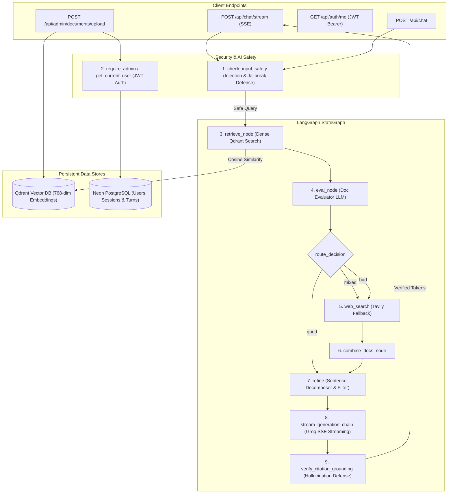

# ⚡ MentorX Backend API & LangGraph RAG Service

FastAPI-powered backend microservice orchestrating an **Adaptive Agentic RAG Pipeline** with LangGraph, PostgreSQL (Neon) ORM, Qdrant Vector Store, AI Safety Guardrails, and Cryptographic RBAC for academic admission guidance.

---

## 🏛️ Architecture & LangGraph Pipeline



---

## ⚙️ Configuration Settings (`app/config/settings.py`)

All settings are strongly typed and validated with Pydantic `BaseSettings`:

| Environment Variable | Default Value | Description |
| :--- | :--- | :--- |
| `DATABASE_URL` | *Required* | Neon PostgreSQL connection string (`postgresql://...`) |
| `JWT_SECRET_KEY` | *Configurable* | Secret key used to sign and verify HMAC-SHA256 JWT tokens |
| `JWT_ALGORITHM` | `HS256` | Cryptographic algorithm for JWT signatures |
| `ACCESS_TOKEN_EXPIRE_MINUTES` | `10080` (7 days) | Token validity duration in minutes |
| `ADMIN_EMAILS` | `haseebahmadcool678@gmail.com,admin@mentorx.edu` | Comma-separated emails granted automatic admin privileges |
| `GOOGLE_API_KEY` | *Required* | Google AI API key for `models/text-embedding-004` embeddings |
| `GROQ_API_KEY` | *Required* | Groq API key for LPU high-speed inference |
| `GROQ_MODEL` | `openai/gpt-oss-120b` | LLM model deployed on Groq for admissions reasoning |
| `QDRANT_URL` | *Required* | Qdrant Cloud or local cluster endpoint |
| `QDRANT_API_KEY` | *Required* | Qdrant vector database authentication key |
| `QDRANT_COLLECTION_NAME` | `mentorx` | Vector collection name |
| `TAVILY_API_KEY` | *Optional* | Tavily API key for real-time live web fallback searches |
| `CHUNK_SIZE` | `1000` | Character chunk window for recursive text splitting |
| `CHUNK_OVERLAP` | `300` | Overlap between consecutive text chunks |
| `LANGCHAIN_TRACING_V2` | `true` | Enables LangSmith distributed pipeline tracing |
| `LANGCHAIN_API_KEY` | *Optional* | LangSmith observability API key (`lsv2_pt_...`) |
| `LANGCHAIN_PROJECT` | `mentorx` | Project workspace name in LangSmith |

---

## 🛡️ Security & AI Safety Guardrails

1. **Role-Based Access Control (RBAC)**:
   - Cryptographic JWT issuance via `app.core.security` with HMAC-SHA256.
   - Endpoint protection via `app.api.deps`: `get_current_user` and `require_admin`.
   - Supervisor administrative operations (`/api/admin/*`) require valid admin privileges.
2. **Input Injection Defense**:
   - `check_input_safety` in `app/Pipeline/guardrails.py` detects prompt overrides, role hijack attempts, delimiters, and adversarial inputs before triggering vector or LLM calls.
3. **Hallucination & Citation Verification**:
   - `verify_citation_grounding` validates numerical claims, aggregate percentages, and inline citations (`[1]`, `[2]`) against retrieved syllabus context chunks.

---

## 📦 Key Modules

- **`app/Pipeline/`**: LangGraph StateGraph pipeline containing `retrieve_node`, `eval_node`, `refine`, `web_node`, `combine_docs_node`, `generate_node`, and `guardrails`.
- **`app/models/`**: SQLAlchemy 2.0 ORM models (`User`, `Document`, `ChatSession`, `ChatMessage`).
- **`app/api/`**: APIRouters for Chat (streaming & standard), Authentication (Google OAuth & JWT), and Admin operations.
- **`app/services/`**: Business logic encapsulation for user management, document ingestion, and chat turns.
- **`app/utility/`**: Structured output Pydantic chains (`doc_eval_chain`, `filter_chain`, `web_rewrite_chain`).
- **`app/Chunker/`**: Recursive text chunking with configurable overlap.
- **`app/LLM/`**: LLM factory for Groq and Google Generative AI embeddings.

---

## 🚀 Local Development

1. **Create Virtual Environment**:
   ```bash
   python3 -m venv .venv
   source .venv/bin/activate
   ```
2. **Install Dependencies**:
   ```bash
   pip install -r requirements.txt
   ```
3. **Configure Environment Variables**:
   ```bash
   cp .env.example .env
   # Populate DATABASE_URL, JWT_SECRET_KEY, GOOGLE_API_KEY, GROQ_API_KEY, QDRANT_URL, QDRANT_API_KEY
   ```
4. **Run Server**:
   ```bash
   uvicorn app.main:app --reload --port 8000
   ```
   Interactive OpenAPI docs available at `http://localhost:8000/docs`.

---

## 🧪 Automated Testing

Run the automated test suites:
```bash
# AI Safety Guardrails & Prompt Injection Test
PYTHONPATH=. python3 tests/test_guardrails.py

# Cryptographic JWT & RBAC Access Control Test
PYTHONPATH=. python3 tests/test_auth_rbac.py

# RAG Triad Benchmark Suite (Faithfulness, Relevance, Context Precision)
PYTHONPATH=. python3 tests/eval_rag_triad.py
```

---

## 🚢 Production Deployment on Render

MentorX runs continuous persistent containers on Render, ensuring uninterrupted SSE streaming:

### Option 1: Native Python Web Service
- **Root Directory**: `backend`
- **Runtime**: `Python 3`
- **Build Command**: `pip install -r requirements.txt`
- **Start Command**: `uvicorn app.main:app --host 0.0.0.0 --port $PORT`

### Option 2: Docker Container Web Service
- **Runtime**: `Docker`
- Automatically leverages the multi-stage [`backend/Dockerfile`](file:///run/media/haseeb-ahmad/Personal%20Data/MentorX/mentorx/backend/Dockerfile) with libpq runtime and unprivileged `appuser`.

