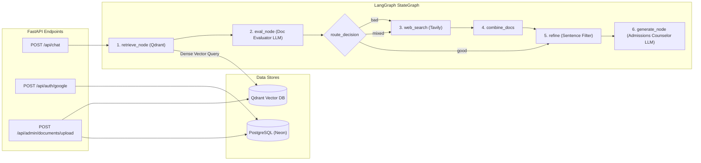

# ⚡ MentorX Backend API & LangGraph RAG Service

FastAPI-powered backend microservice orchestrating an **Adaptive Agentic RAG Pipeline** with LangGraph, PostgreSQL (Neon) ORM, and Qdrant Vector Store for academic admission guidance.

---

## 🏛️ Architecture & LangGraph Pipeline



---

## 📦 Key Modules

- **`app/Pipeline/`**: LangGraph StateGraph pipeline containing `retrieve_node`, `eval_node`, `refine`, `web_node`, `combine_docs_node`, and `generate_node`.
- **`app/models/`**: SQLAlchemy 2.0 ORM models (`User` and `Document`).
- **`app/api/`**: FastAPI APIRouters for Chat, Authentication, and Admin operations.
- **`app/services/`**: Business logic encapsulation for user management and document ingestion.
- **`app/utility/`**: Structured output Pydantic chains (`doc_eval_chain`, `filter_chain`, `web_rewrite_chain`).
- **`app/Chunker/`**: Recursive text chunking with configurable window and overlap.
- **`app/LLM/`**: LLM factory for Groq LLaMA 3.3 70B and Google Generative AI embeddings.

---

## 🚀 Quickstart

1. **Create Virtual Environment**:
   ```bash
   python3 -m venv .venv
   source .venv/bin/activate
   ```
2. **Install Dependencies**:
   ```bash
   pip install -e .
   ```
3. **Configure Environment**:
   ```bash
   cp .env.example .env
   ```
4. **Run Server**:
   ```bash
   uvicorn app.main:app --reload --port 8000
   ```
   Interactive OpenAPI docs available at `http://localhost:8000/docs`.
